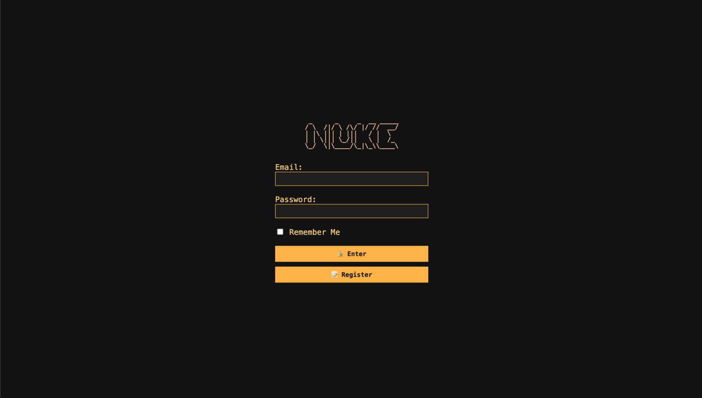
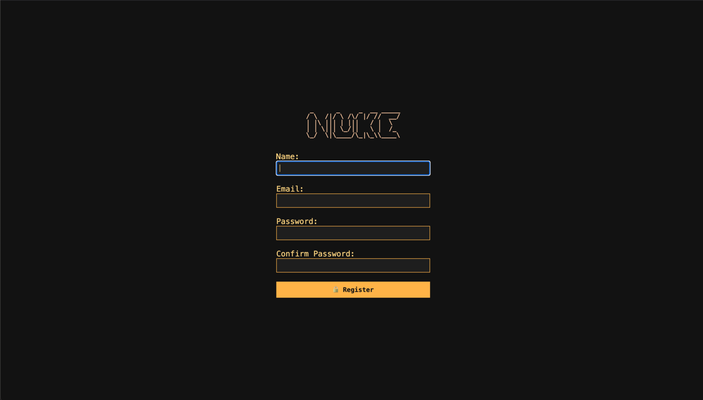
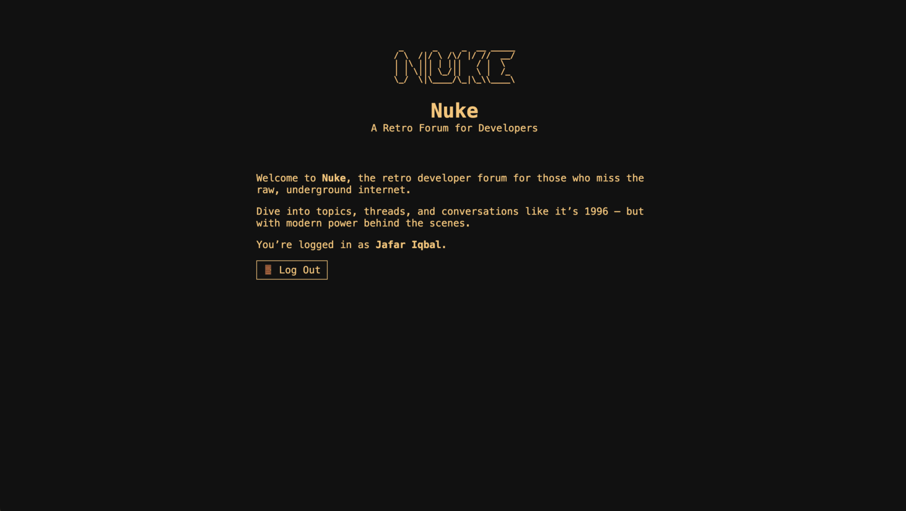
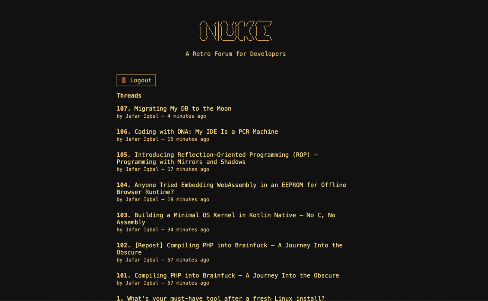
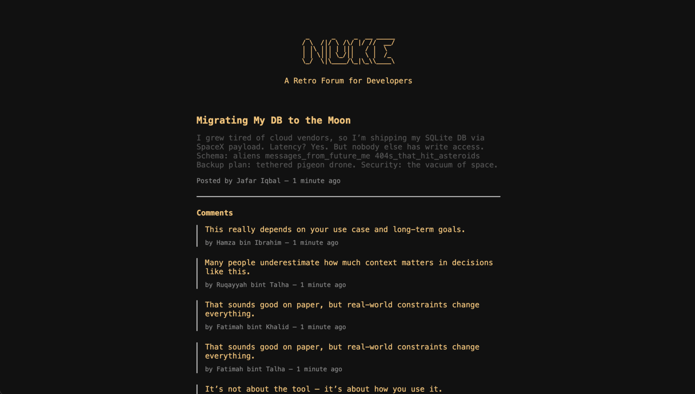
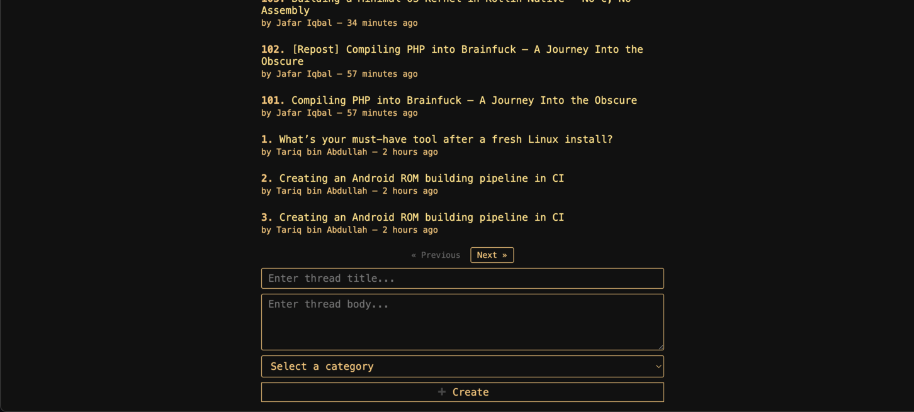
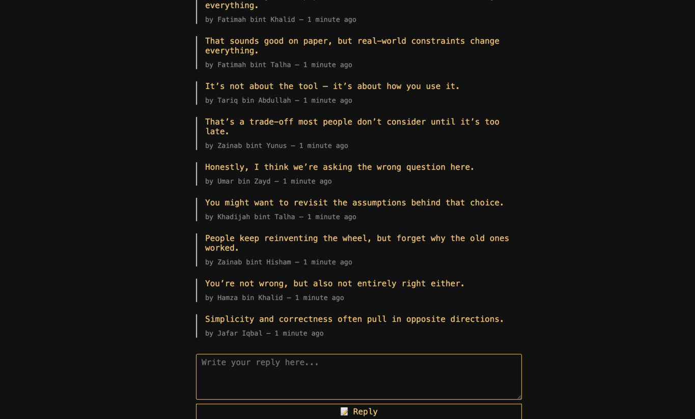

# Nuke

A retro-style developer forum built with Laravel.  
Minimalist UI. ASCII vibes. Maximum focus.

---

## Features

- Early '90s web design — minimal, raw, nostalgic.
- Basic forum functionality: threads, replies, profiles.
- Nothing comes in mind anymore.

---

## Screenshots

  
  

